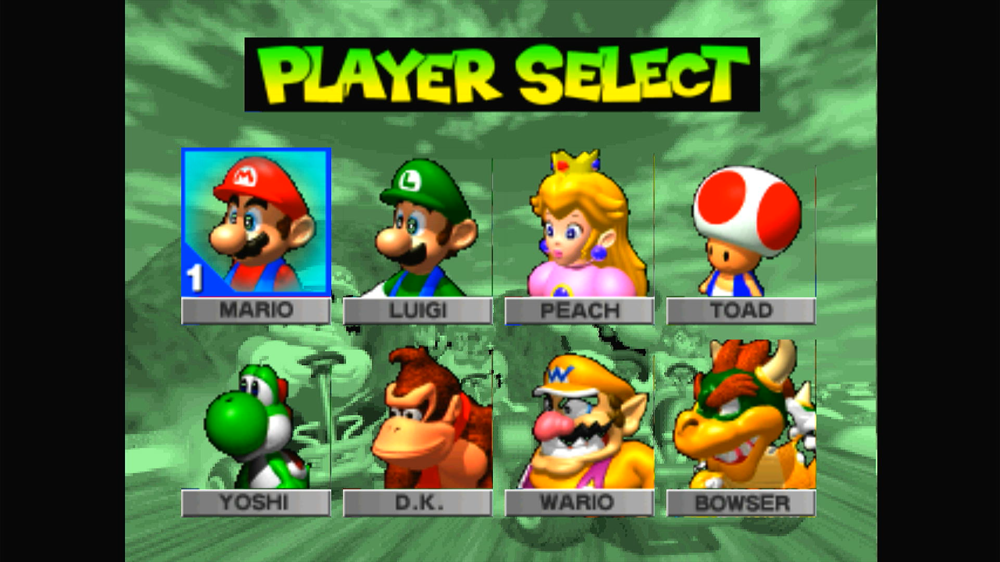
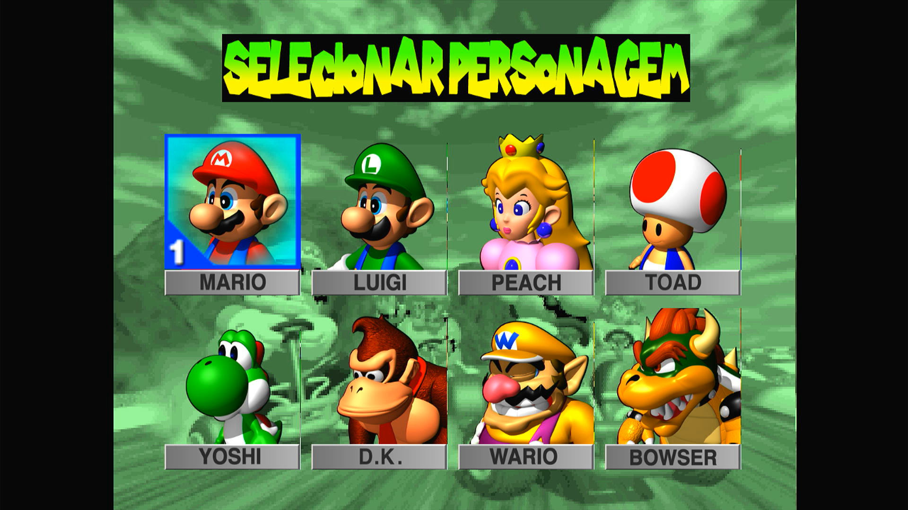
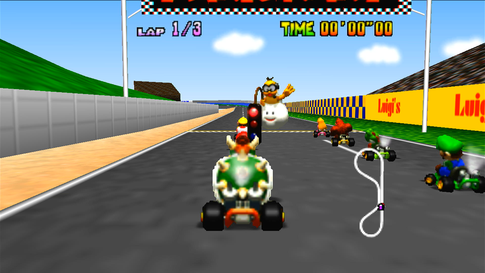

# MKart360 — Edit Textures Fork

Fork of [sirdankz/MKart360](https://github.com/sirdankz/MKart360) (Xbox 360
port of Mario Kart 64, based on the [n64decomp/mk64](https://github.com/n64decomp/mk64)
decompilation). This fork adds a **runtime HD texture replacement system**,
without modifying the ROM or the compiled game assets, and works with **all ROM regions** thanks to my personal friend **[Eduardo](https://github.com/EduDicaseGameplay)** from the YouTube channel **[Edu Dicas e Gameplay](https://www.youtube.com/@EduDicaseGameplay)**,

---

## What changed compared to the original project

### Modified code

- **`mk64-master/include/xbox360/gfx_pc.c`**
  HD texture hook inside `import_texture()`: the game computes an FNV-1a
  hash of each original texture's content, and if an HD version with that
  hash exists, it's used instead. Includes:
  - reading `tex.pak` through a hash-indexed table;
  - fallback to standalone `.tex` files in subfolders (to work around the
    FATX per-folder file limit);
  - **full in-memory loading of `tex.pak`, in the background**: as soon as
    the game starts, a separate thread reads the whole file with sequential
    reads (1 to 2 seconds on an internal HDD, without the game waiting).
    After that, no disk reads happen during gameplay. Only used if the pack
    fits while leaving 128 MB free;
  - RAM cache for HD textures, sized from the console's free memory (40 to
    160 MB), used when the pack doesn't fit entirely in memory;
  - enlarged texture cache (from 512 to 1024 entries);
  - diagnostic trace disabled by default (`X360_HDTEX_TRACE 0`), with a
    menu mode (`X360_HDTEX_TRACE_MENU`) that also logs each piece's position;
  - the HD hook no longer overwrites the texture cache's content hash —
    this fixed flickering on menu textures loaded in blocks;
  - **DXT1/DXT5 compression** inside `tex.pak` (see
    [Compressed tex.pak](#compressed-texpak-dxt)): textures go **compressed
    straight to the GPU**, which reads DXT natively — 4 to 8 times less video
    memory, with no decompression on the CPU. Uncompressed `tex.pak` files
    are still read normally.
  - `x360_try_draw_hd_menu_quad` already exists in the code but is
    **inactive** (not called yet) — reserved for a future replacement of
    the large menu textures.

- **`mk64-master/.gitignore`**
  Now ignores extracted textures, `tex.pak`, trace logs, and
  `src/xbox360/generated_banks/` (all derived from the user's own ROM, and
  shouldn't go into version control).

### Known limitations

- High-resolution textures (higher than HQ) can overload the Xbox 360 hardware and cause crashes or performance issues; HD support exists but is limited to the console's hardware.
- `tex.pak` is loaded entirely into memory when the game starts, so there are
  no disk reads during races, even on an internal mechanical HDD. This requires
  the pack to fit while leaving 128 MB free (on a console with ~400 MB free, up
  to about 270 MB). If it's larger, the game goes back to reading from disk as
  needed and, on a mechanical HDD, small hitches may return; in that case,
  shrink the pack (see [Common issues](#common-issues)).
- DXT compression is lossy. On higher-resolution textures (from ~128×128, or
  2× the original or more) the difference is practically invisible; small
  textures may show a little grain or small color shifts (see
  [Compressed tex.pak](#compressed-texpak-dxt)).

---

## 🖼️ Preview

### Previous background 

<p align="center">
  
</p>

### Background later

<p align="center">
  
</p>

### Select game first

<p align="center">
  
</p>

### Select game later

<p align="center">
  
</p>

### Select character first

<p align="center">
  
</p>

### Select character later

<p align="center">
  
</p>

### Select maps first

<p align="center">
  
</p>

### Select maps later

<p align="center">
  
</p>

### gameplay of the game from before

<p align="center">
  
</p>

### gameplay of the game later

<p align="center">
  
</p>

---

## New tools

All the scripts below must be executed from within the `mk64-master/` folder; those created for diagnostics/debugging and testing are located in the `legacy_diagnostic_tools/` folder but must be moved to `mk64-master/` to work—with the exception of `HALVE_PNGS.py`, which works from any location.

| File | Purpose |
|---|---|
| `EXTRACT_MK64_TEXTURES.py` | Extracts textures from the ROM into editable PNGs |
| `PACK_TEXTURES.py` | Packs edited PNGs back into the format the game reads (`tex.pak`) |
| `HALVE_PNGS.py` | Reduces PNG resolution (half, factor, percentage, max side or exact size) to fit the console's memory; use it for very large textures or if you encounter performance issues |
| `DXT_PREVIEW.py` | Shows on the PC, side by side with the original, how each texture will look with `--dxt` (uses the same decoder as the console) |
| `SCAN_HALVES.py` | Diagnostic tool: finds where the "bottom halves" of kart sprites live when their hash doesn't match |
| `CROSS_CHECK.py` | Cross-references the game's trace log with the manifests to find textures that weren't found |
| `SCAN_MENU.py` | Measures how the game splits large menu images into blocks, from a trace log |
| `menu_tiles_geometry.json` | Measured block layout of the menu images (coordinates only, no ROM data) |

One-time install requirement:

```powershell
pip install pillow
```

### Full usage workflow

**1. Extract textures from the ROM**

```powershell
py .\EXTRACT_MK64_TEXTURES.py --rom .\baserom.us.z64
```

Generates the `extracted_textures\` folder with:

- **root** — common textures, named `<hash>__name.png`;
- **`generated\`** — generated banks (menus, HUD), named by symbol;
- **`karts\<character>\frames\`** — driver+kart sprites (321 per
  character);
- **`*_manifest.json`** — metadata linking each PNG to its hash. **Do not
  delete or move these files.**

By default the extractor doesn't overwrite existing PNGs (safe to re-run —
it only fills in what's missing). Use `--force` to regenerate everything
from scratch (discards your edits). Other options: `--no-karts`,
`--no-generated`, `--out FOLDER`.


**2. Edit**

Open the PNGs and redraw/upscale them in HD. You can freely change the
resolution (e.g. 128×128 instead of a 64×64 original). **Don't rename the
files** — the name (or the path recorded in the manifest) is what links the
edited texture back to the original.

**3. Pack**

```powershell
py .\PACK_TEXTURES.py --only karts --pak
```

Generates `tex\tex.pak`, a single file with everything bundled inside.

| Option | Effect |
|---|---|
| `--pak` | Produces a single file (**recommended**) |
| `--only PREFIX` | Limits to a subset, e.g. `--only karts\bowser` |
| `--out FOLDER` | Output folder (default `tex`) |
| `--max N` | Skips images larger than N pixels (default 2048) |
| `--dxt` | With `--pak`: stores textures compressed as DXT1/DXT5 (**recommended**, see below) |
| `--dxt-compacto` | With `--dxt`: sprites with on/off transparency as DXT1 (half the size, slightly lower quality) |
| `--dxt-sem-ajuste` | With `--dxt`: doesn't resample crops that aren't multiples of 4 (they stay uncompressed) |

Without `--pak`, thousands of loose `.tex` files are generated — it works,
but loads more slowly and is more fragile to transfer; use it only for
debugging. Only pack what you actually edited: unedited PNGs produce
textures identical to the originals, with no visual gain but still costing
space and memory.

**4. Install on the console**

Copy `tex.pak` to the root of the game folder, next to the executable:

```
MK64.xex
baserom.us.z64
tex.pak          <- here, NOT inside a tex\ folder
```

Swapping textures doesn't require recompiling .XEX file — `tex.pak` is read at
runtime. Recompiling is only needed when you change C code.

### Compressed tex.pak (DXT)

```powershell
pip install numpy
py .\PACK_TEXTURES.py --pak --dxt
```

Each texture is stored as **DXT1** (opaque, ~8× smaller than RGBA) or **DXT5**
(with transparency, ~4× smaller) and travels **compressed all the way to the
GPU**: the Xbox 360 reads DXT natively, with no decompression on the CPU. As
a result:

- **video memory drops 4 to 8 times** — for the full HD texture pack, from
  ~808 MB to ~196 MB;
- `tex.pak` gets much smaller, the console reads less from disk and more
  textures fit in the RAM cache;
- you can use **higher resolutions in the same space**: a 256×256 sprite in
  DXT5 takes the same memory as a 128×128 one uncompressed.

**Broad support:** practically every texture is compressed. DXT requires
width and height to be multiples of 4; the crops the game uses outside that
pattern (menu background and title strips, fonts, crops with an overlap row)
are **automatically resampled** to the next multiple of 4. The game stretches
each HD texture to cover the original's area, so nothing moves. Only the menu
"OK" button always stays uncompressed. When done, the packer reports how many
textures were compressed and writes the ones that weren't (if any) to
`tex\dxt_sem_compressao.txt`.

**Quality:** the encoder picks each 4×4 block's colors along the principal
color axis and refines them by least squares (close to professional
encoders). Sprites and textures with transparency use DXT5, which preserves
colors better. DXT is still lossy, and the result depends on resolution:

- **large textures** (from ~128×128, or 2× the original or more): the
  difference is practically invisible;
- **small textures** (close to the N64's original resolution): some grain or
  small color shifts may show, because each 4×4 block covers a larger part of
  the drawing.

**Compact mode (`--dxt-compacto`).** Only affects textures with on/off
transparency (each pixel fully visible or fully transparent): kart and
character sprites, items, trees. By default they use DXT5 (4 colors per 4×4
block + separate transparency, 1 byte per pixel); in compact mode they use DXT1
(3 colors + "transparent", half a byte per pixel).

- **Pros:** sprites at **half the size** — since karts are most of the pack,
  `tex.pak` shrinks a lot (e.g. from ~210 MB to ~130 MB), more memory is left
  free and loading gets faster.
- **Cons:** slightly lower color quality on sprites (about 1.7 dB less in
  measurements): a little grain or slightly lighter edges may show, more
  noticeable on low-resolution sprites.
- Opaque textures and textures with smooth transparency don't change.

To decide, compare both versions on the PC:

```powershell
py .\DXT_PREVIEW.py extracted_textures\karts\mario\frames --max 20 --zoom 2 --out dxt_preview_padrao
py .\DXT_PREVIEW.py extracted_textures\karts\mario\frames --max 20 --zoom 2 --compacto --out dxt_preview_compacto
py .\PACK_TEXTURES.py --pak --dxt --dxt-compacto     # if you like the result
```

To check before going to the console, `DXT_PREVIEW.py` produces side-by-side
images (original | DXT) using the same decoder as the console:

```powershell
py .\DXT_PREVIEW.py extracted_textures\karts\mario\frames --max 30 --zoom 2
```

Other notes:

- **It helps full loading:** the smaller `tex.pak` is, the more room it has to
  fit entirely in memory (see the `gfx_pc.c` description).
- A compressed `tex.pak` **requires the updated `gfx_pc.c` and
  `xbox360_renderer.cpp`**; older builds can't read it. The updated build
  reads both compressed and uncompressed packs.

### Memory limits

The Xbox 360 has 512 MB shared between system and video. The full
character roster adds up to 2568 sprites (2 halves each):

| Resolution | Uncompressed | With `--dxt` (DXT5) | Notes |
|---|---|---|---|
| 256×256 | ~640 MB | ~160 MB | fits with `--dxt` |
| 128×128 | ~160 MB | ~40 MB | |
| 96×96 | ~90 MB | ~23 MB | |

With `--dxt`, 256×256 karts take the same memory as 128×128 ones
uncompressed, at twice the resolution.

To shrink already-edited PNGs (with no size option, it halves them):

```powershell
py .\HALVE_PNGS.py --recursive                     # preview, doesn't change anything
py .\HALVE_PNGS.py --apply --recursive             # actually applies it (half)
py .\HALVE_PNGS.py --max 256 --recursive --apply   # caps the longest side at 256 px
```

Other ways to pick the size: `--fator N` (divide by N), `--escala P`
(percentage) and `--tamanho WxH` (exact size). Dimensions are always kept as
multiples of 4, for DXT. Use `--backup` to keep the originals as `*.orig.png`
and `--restaurar` to bring them back.

### Diagnostics (when a texture doesn't show up in HD)

In `include\xbox360\gfx_pc.c`, change:

```c
#define X360_HDTEX_TRACE 0   →   1
```

Recompile, play for a few seconds, then grab `game:\hdtex-trace.log`. Each
line shows the hash computed at runtime and `found=1` or `found=0`. To
cross-reference that log with the manifests:

```powershell
py .\CROSS_CHECK.py --log .\hdtex-trace.log --kart bowser
```

If the missing texture is a kart sprite's "bottom half" that never matches
(`found=0` even though it exists in the manifest), run:

```powershell
py .\SCAN_HALVES.py --rom .\baserom.us.z64 --log .\hdtex-trace.log --kart bowser
```

This scans the decompressed ROM block looking for which 2048-byte window
produces the missing hash, revealing the half's real offset — useful for
fixing the extractor.

Leave the trace disabled during normal use: it writes to disk during
gameplay and affects performance.

### Menu textures

Large menu images (e.g. the character-select portraits) exceed the 4 KB
TMEM, so the game loads them in blocks (33×33 with a 1-texel overlap), each
with its own hash. `menu_tiles_geometry.json` stores the measured block
layout; `PACK_TEXTURES.py` computes each block's hash from **your own** ROM
data and crops the HD art to match. Nothing to do: just edit the PNG under
`extracted_textures\generated\course_player_selection\` and pack.

To add a screen that isn't measured yet: set `X360_HDTEX_TRACE 1` in
`gfx_pc.c`, rebuild with `/t:Rebuild`, stay a few seconds on the screen,
copy `hdtex-trace.log` to `mk64-master\` and run:

```powershell
py .\SCAN_MENU.py --log .\hdtex-trace.log --only generated/course_player_selection
```

It adds the new images to `menu_tiles_geometry.json`. Set the trace back to
`0` afterwards.

### Common issues

- **Textures don't show up** → check that `tex.pak` is at the root, next
  to `MK64.xex` (not inside `tex\`). If that's correct, force a full
  rebuild (`/t:Rebuild`) — `gfx_pc.c` is included by another file, and
  incremental builds sometimes miss the change.
- **Only half the sprite is HD** → CI8 sprites are loaded in two windows
  because of the 4 KB TMEM limit, each with its own hash. The extractor
  already handles this; if it happens, regenerate the manifests with the
  updated extractor and repack.
- **Transfer to the console fails at the end** → the Xbox 360's file
  system (FATX) allows a maximum of 4096 files per folder. That's exactly
  what the `--pak` option solves, by producing a single file.
- **Stutters in-game** → most likely `tex.pak` didn't fit entirely in memory
  (it must leave 128 MB free; on a console with ~400 MB free, up to about
  270 MB). Shrink the pack: use `--dxt`, `--dxt-compacto` (sprites at half the
  size) or lower the resolution with `HALVE_PNGS.py`. Right after the game
  starts, loading takes 1 to 2 seconds; entering a race before that may cause
  a hitch.

### How it works under the hood

1. The game loads a texture and computes an FNV-1a hash of the original
   content.
2. `gfx_pc.c` looks up that hash in `tex.pak`.
3. If found, the HD version is sent to the GPU instead of the original.
4. If not found, it falls back to the normal path — nothing breaks.

Original dimensions are preserved internally for coordinate mapping, so
the HD texture can be any resolution. Loaded data is cached in RAM to
avoid re-reading from disk.

---

## How to build the project

### Requirements

- Windows
- Python 3
- Xbox 360 SDK / Visual Studio Xbox 360 build tools
- Your own US Mario Kart 64 ROM
- An Xbox 360 capable of running homebrew XEX files

### 1. Prepare the assets

Place your ROM at:

```
mk64-master\baserom.us.z64
```

Then, inside `mk64-master`:

```powershell
powershell -ExecutionPolicy Bypass -File ".\xbox360\setup_windows_asset_tools.ps1" -SkipTorch
```
Wait for all the necessary requirements to download and install, and then:

```powershell
py ".\PUBLIC_PREPARE_MK64_ASSETS.py"
```

The script verifies the ROM and generates the ROM-derived files that are
intentionally left out of the public source release.

### 2. Build

From the folder containing `MK64.sln`, run:

```powershell
& "$env:WINDIR\Microsoft.NET\Framework\v4.0.30319\MSBuild.exe" ".\MK64.sln" /t:Build "/p:Configuration=Release" "/p:Platform=Xbox 360"
```

Or, more simply:

```powershell
powershell -ExecutionPolicy Bypass -File ".\PUBLIC_BUILD_XBOX360.ps1"
```

The compiled `.xex` will be placed in the Xbox 360 project's Release
output folder.

### 3. Apply HD textures (optional)

After building, generate and copy `tex.pak` as described in the
["New tools"](#new-tools) section above. Swapping textures afterward
doesn't require rebuilding.

> If something doesn't take effect after editing `gfx_pc.c`, force
> `/t:Rebuild` — incremental builds sometimes don't detect changes to that
> file.

---

## Credits

- **[n64decomp/mk64](https://github.com/n64decomp/mk64)** — the original
  Mario Kart 64 decompilation, the foundation of the whole project.
- **[sirdankz/MKart360](https://github.com/sirdankz/MKart360)** — the
  Xbox 360 port (native build, console-to-console multiplayer, rendering
  fixes), of which this repository is a fork.
- **[Edu dicas e gameplay](https://github.com/EduDicaseGameplay)** - The person
  who managed to simply decipher the texture extraction system of "TKMK00" so that
  it was possible to replace the frames and textures of the main menu, in addition
  to having managed to improve the extraction system to a point that I could not achieve.

Mario Kart 64 and related properties belong to Nintendo. This is an
unofficial homebrew port, not affiliated with or endorsed by Nintendo.
